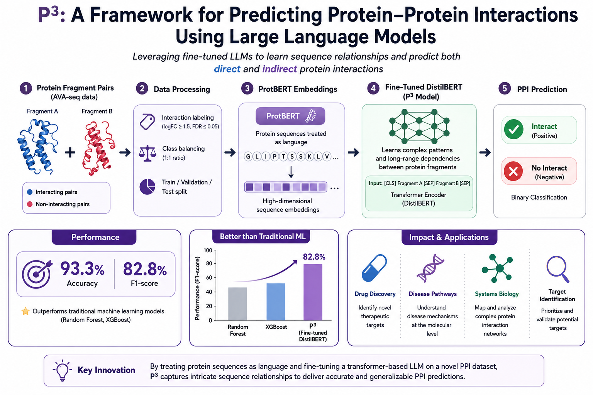

<p align="center">
  
</p>

<!-- <h1 align="center">P3: A Framework for Predicting Protein-Protein Interactions Using Large Language Models</h1>

<p align="center">
  <em>A fine-tuned, transformer-based pipeline that treats protein sequences as language to predict direct and indirect protein-protein interactions with high accuracy and generalizability.</em>
</p> -->

<p align="center">
  <a href="https://doi.org/10.21203/rs.3.rs-6309474/v1"></a>
  <a href="http://creativecommons.org/licenses/by/4.0/"></a>
</p>

## Overview

**P3** is a fine-tuning pipeline for predicting protein-protein interactions (PPIs) from protein sequence fragments. It addresses key limitations of conventional PPI prediction methods — **reliance on handcrafted features**, **difficulty modeling indirect or long-range dependencies**, and **poor scalability to large, heterogeneous datasets** — by treating protein sequences as natural language and fine-tuning a BERT-based large language model directly on the prediction task.

By encoding protein fragments into high-dimensional, context-aware embeddings, P3 captures both direct and indirect interaction signals that traditional CNN- and GNN-based approaches often miss. The fine-tuned model reaches **93.3% accuracy** and an **F1-score of 82.8%** on the full evaluation dataset, consistently outperforming a Random Forest–XGBoost baseline across all metrics.

This repository contains the code and pipeline introduced in our paper:

> **P3: A Framework for Predicting Protein-Protein Interactions Using Large Language Models**
> Lamiaa Basyoni, Jovana Aleksic, Stephanie Schaefer-Ramadan, Yue Guan, Joel Malek, and Ahmed Serag.
> *Research Square* preprint (2025). Posted 22 May 2025.
> [Read the preprint on Research Square](https://doi.org/10.21203/rs.3.rs-6309474/v1)


## Key Features

- **Sequence-Based PPI Prediction:** Classifies pairs of protein sequence fragments as interacting or non-interacting, capturing both direct and indirect relationships.
- **Fine-Tuned LLM Backbone:** Uses a DistilBERT model fine-tuned specifically for PPI classification, rather than relying on zero-shot generative models or handcrafted features.
- **ProtBERT Tokenization:** Encodes amino acid sequences into context-aware embeddings using ProtBERT, supporting both residue-level and pooled protein-level representations.
- **Real Experimental Data:** Trained on AVA-seq (All-Versus-All Sequencing) interaction data generated in-house from *Helicobacter pylori* gene fragments, statistically filtered using edgeR and Fisher's exact test (logFC and FDR thresholds).
- **Class Balancing:** Applies Random Undersampling to correct substantial class imbalance (initial 1:7 positive-to-negative ratio) and achieve a 1:1 training distribution.
- **Baseline Comparison:** Benchmarks the fine-tuned model against a standalone Random Forest classifier trained with XGBoost.
- **Scales With Data:** Demonstrates significant performance gains when moving from an initial dataset (~75,000 fragment pairs) to a full dataset (over 1.3 million pairs).

## Repository Structure

- **Fine-tuning pipeline** — Data collection, labeling, verification, preprocessing, fine-tuning, and prediction stages (see Figure 1 in the paper).
- **Tokenization module** — ProtBERT-based encoding of protein sequences into amino-acid-level and pooled embeddings.
- **Model training scripts** — DistilBERT fine-tuning on labeled PPI fragment-pair data (trained on an NVIDIA A100 GPU).
- **Baseline classifier** — Random Forest model trained with XGBoost for comparison.
- **`data/`** — AVA-seq fragment-pair statistical data (logFC, FDR); not redistributed due to data-sharing terms (available on reasonable request).

## Installation

```bash
git clone https://github.com/serag-ai/P3.git
cd P3

python -m venv p3-env
# Windows
p3-env\Scripts\activate
# Linux / macOS
source p3-env/bin/activate

pip install -r requirements.txt
```

## Usage

### Data Preparation

Fragment pairs are classified as interacting or non-interacting using the following thresholds, derived from edgeR/Fisher's exact test statistics:

```python
# A fragment pair is labeled "interacting" if:
# logFC > 1.5 AND FDR < 0.05

interacting = (logFC > 1.5) and (FDR < 0.05)
```

### Tokenization and Embedding

Protein sequences are tokenized with ProtBERT prior to fine-tuning:

```python
# Tokenize a protein sequence with positional encoding
tokens = protbert_tokenizer("SEQ")

# Generate context-aware embeddings from the last hidden state
embeddings = protbert_model(tokens).last_hidden_state

# Pool along the sequence length for a fixed-size, protein-level embedding
pooled_embedding = global_average_pool(embeddings)
```

### Fine-Tuning and Prediction

```python
# Fine-tune DistilBERT on labeled fragment-pair data
model = fine_tune_distilbert(train_data, val_data, epochs=..., gpu="A100")

# Predict whether two protein fragments interact
predict_interaction(model, fragment_a="NP_206803.1:31", fragment_b="NP_207511.1:241")

# Evaluate on held-out test data
evaluate(model, test_data)
```

## Results

| Dataset | Model | Accuracy (%) | Recall (%) | Precision (%) | F1-score (%) |
|---|---|---|---|---|---|
| Initial dataset | Fine-tuned DistilBERT | 88.1 | 74.2 | 79.0 | 76.5 |
| Initial dataset | Random Forest–XGBoost | 68.9 | 77.4 | 66.2 | 73.4 |
| Full dataset | Fine-tuned DistilBERT | **93.3** | 79.0 | **87.0** | **82.8** |
| Full dataset | Random Forest–XGBoost | 68.0 | 77.0 | 66.0 | 74.0 |

Fine-tuned DistilBERT scales substantially better with additional data than the Random Forest–XGBoost baseline, which shows only marginal gains on the larger dataset.

## Dataset

P3 is trained and evaluated on AVA-seq (All-Versus-All Sequencing) data generated at the Functional Genomics laboratory, Weill Cornell Medicine – Qatar, using *Helicobacter pylori* gene fragments cloned into a bacterial two-hybrid vector (pAVA). Interactions were identified via paired-end sequencing and filtered using a negative binomial model (edgeR) and Fisher's exact test.

| Dataset | Protein Sequences | Fragment Pairs |
|---|---|---|
| Initial dataset | 2,000+ | 75,000+ |
| Full dataset | 4,000+ | 1,300,000+ |

While the data do not currently reside in a public repository, they are available upon reasonable request to the corresponding author, in accordance with institutional and ethical guidelines.

## Citation

If you use P3 or this code in your research, please cite:

```bibtex
@article{basyoni2025p3,
  title   = {P3: A Framework for Predicting Protein-Protein Interactions Using Large Language Models},
  author  = {Basyoni, Lamiaa and Aleksic, Jovana and Schaefer-Ramadan, Stephanie and
             Guan, Yue and Malek, Joel and Serag, Ahmed},
  journal = {Research Square},
  year    = {2025},
  doi     = {10.21203/rs.3.rs-6309474/v1},
  url     = {https://doi.org/10.21203/rs.3.rs-6309474/v1},
  note    = {Preprint}
}
```

## Acknowledgements

This work builds on the AVA-seq fragment-based protein-protein interaction methodology developed at Weill Cornell Medicine – Qatar, and on open-source efforts from the community, including [Hugging Face Transformers](https://github.com/huggingface/transformers) for DistilBERT and [ProtTrans/ProtBERT](https://github.com/agemagician/ProtTrans) for protein sequence tokenization and embedding.

## License

Released under the [Creative Commons Attribution 4.0 International (CC BY 4.0)](http://creativecommons.org/licenses/by/4.0/) license.
